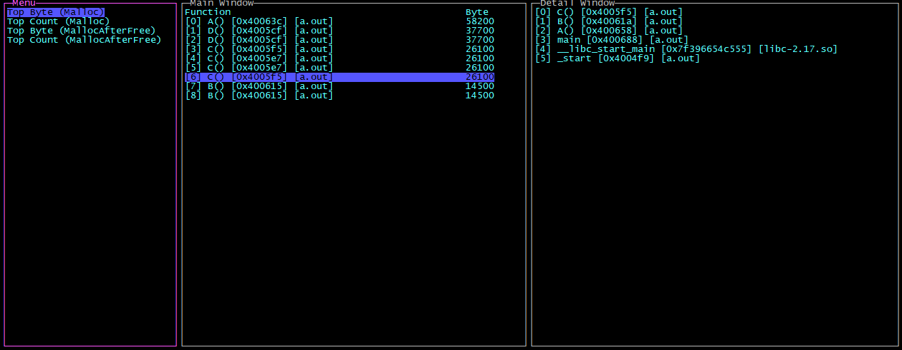

# memory-track



## Overview
A tool to analyze memory usage. Attach to target process record all malloc/free call, 
report memory statistics sorted by highest count/byte.

To use the SystemTap tool to probe system calls, SystemTap should be installed first.

It's running ok on CentOS 7.

## Getting Started

```shell
Usage:
  memory-track [command]

Examples:
memory-track record -p pid [-t sec] [-o path]
memory-track report -i path

Available Commands:
  help        Help about any command
  record      Record target process malloc/free call
  report      Report memory statistics by malloc usage
```

